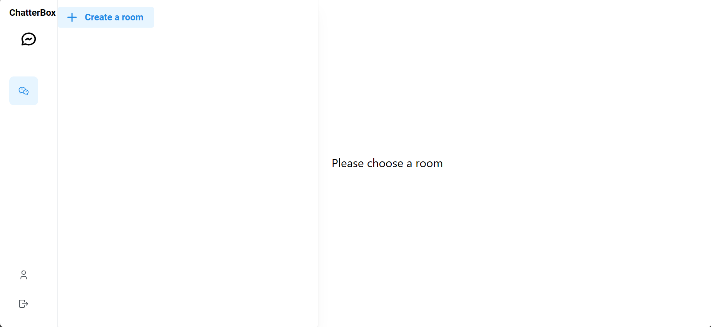
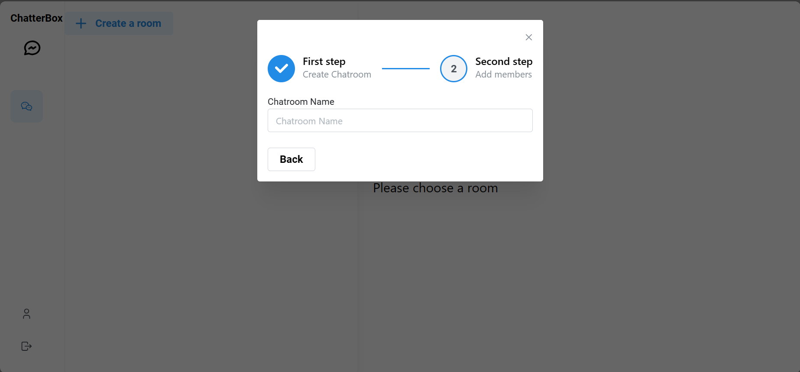
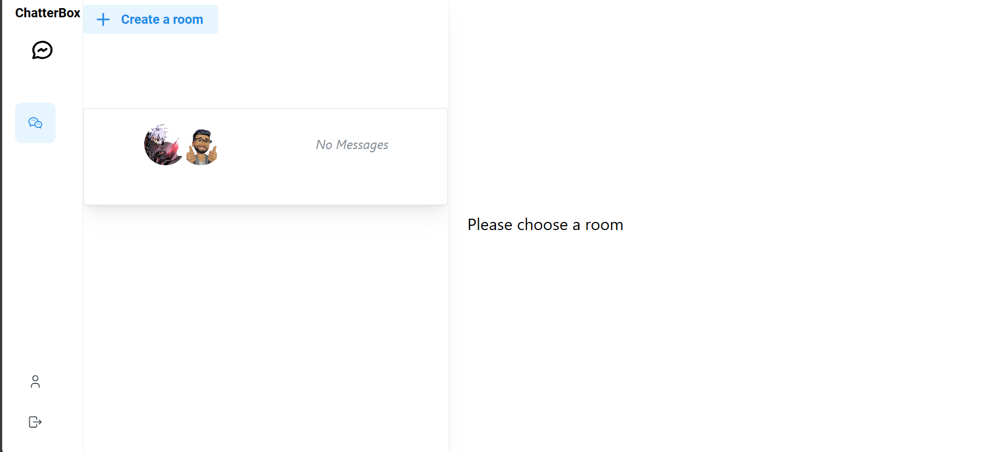
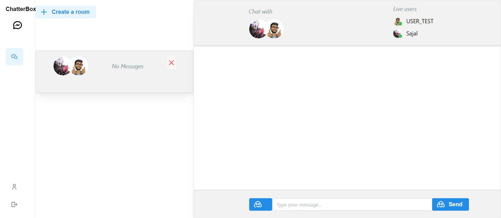
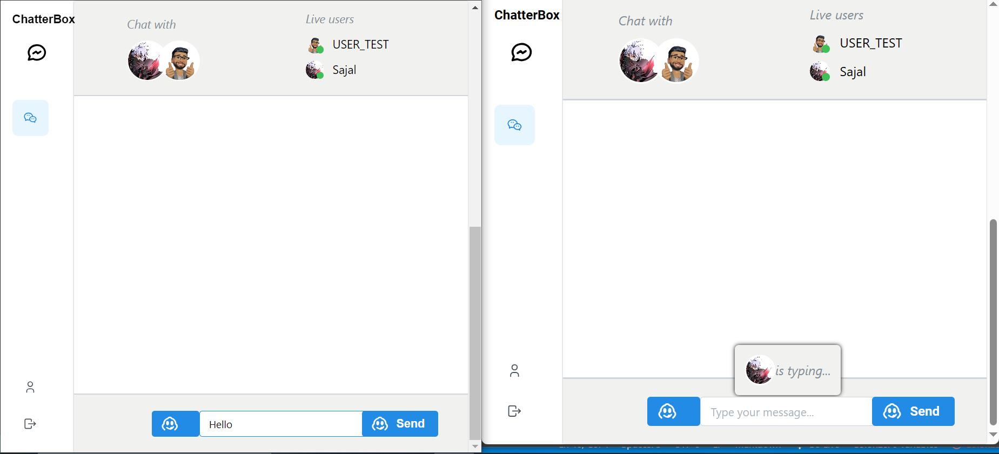

# Chatter Box - Real-time Chat App

## Overview

This project is a FullStack TypeScript Real-time Chat application developed using NestJS, Prisma, GraphQL, Redis, Postgres, ReactJS, Apollo Client, Zustand, and the UI library Mantine. The application allows users to register, log in, and log out securely, manage their profiles, create chatrooms, and engage in real-time conversations with other users.

## Features

- **Authentication Flow**: Users can register, log in, and log out securely using JWT Tokens stored as HttpOnly cookies.
- **Profile Management**: Users can update their names and profile avatars.
- **Chatrooms**: Users can create chatrooms and add members for group conversations.
- **Real-time Features**: Utilizes GraphQL subscriptions over WebSockets for real-time message updates and typing indicators.
- **Online User Tracking with Redis**: Redis stores live users in chatrooms, updating the user list in real-time on the backend.

## Technologies Used

- Backend:
  - NestJS
  - Prisma
  - GraphQL
  - Redis
  - Postgres
- Frontend:
  - ReactJS
  - Apollo Client
  - Zustand
  - Mantine
- Other:
  - Docker
  - Turbo Repo

## Images
1. Landing page


2. After signup


3. Create Room


4. Home Page


5. Room Page


6. Live Chatting.


7. Some chats


## Setup Instructions

1. Clone the repository:

   ```bash
   git clone <repository-url>
   ```

2. Navigate to the project directory:

   ```bash
   cd chatterbox
   ```

3. Install dependencies for the backend:

   ```bash
   cd backend
   npm install
   ```

4. Install dependencies for the frontend:

   ```bash
   cd ../frontend
   npm install
   ```

5. Start the backend server:

   ```bash
   cd ../backend
   npm run start:dev
   ```

6. Start the frontend development server:

   ```bash
   cd ../frontend
   npm start
   ```

7. Open your browser and visit `http://localhost:3000` to view the application.
